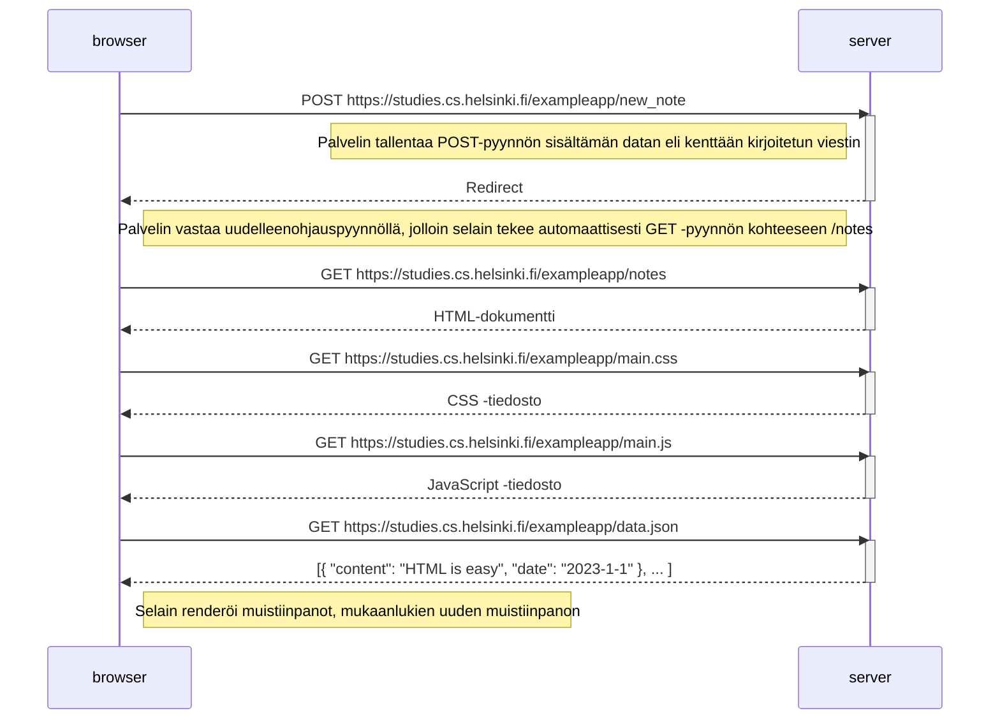

```mermaid
sequenceDiagram
    participant browser
    participant server
    
    browser ->>server: POST https://studies.cs.helsinki.fi/exampleapp/new_note
    activate server
    Note left of server: Palvelin tallentaa POST-pyynnön sisältämän datan eli kenttään kirjoitetun viestin
    server-->>browser: Redirect
    deactivate server
    Note right of browser: Palvelin vastaa uudelleenohjauspyynnöllä, jolloin selain tekee automaattisesti GET -pyynnön kohteeseen /notes 

    browser->>server: GET https://studies.cs.helsinki.fi/exampleapp/notes
    activate server
    server-->>browser: HTML-dokumentti
    deactivate server
    
    browser->>server: GET https://studies.cs.helsinki.fi/exampleapp/main.css
    activate server
    server-->>browser: CSS -tiedosto
    deactivate server
    
    browser->>server: GET https://studies.cs.helsinki.fi/exampleapp/main.js
    activate server
    server-->>browser: JavaScript -tiedosto
    deactivate server
    
    browser->>server: GET https://studies.cs.helsinki.fi/exampleapp/data.json
    activate server
    server-->>browser: [{ "content": "HTML is easy", "date": "2023-1-1" }, ... ]
    deactivate server    
    Note right of browser: Selain renderöi muistiinpanot, mukaanlukien uuden muistiinpanon
```